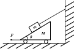

 

.. container:: center

   **Eðlisfræði**

.. container:: center

   **Eðlisfræðideild II**

.. container:: center

   **Matthias Baldursson Harksen**

Verklegar tilraunir
===================

Í þessum hluta munum við kynna helstu aðferðir sem við beitum í
verklegri eðlisfræði. Sökum Covid-19 þurfum við að finna betri leið til
þess að útfæra verklega kennslu. Ég hef því tekið saman nokkrar
tilraunir fyrir ykkur til að framkvæma í heimahúsum aðeins með símana
ykkar og einfaldan tækjabúnað að vopni. Til þess að framkvæma þessar
tilraunir skuliði sækja forritið ``phyphox`` sem ætti að vera
aðgengilegt fyrir alla snjallsíma.

Eðlismassi pappírs
------------------

Inngangur
~~~~~~~~~

Í þessari tilraun ætlum við að mæla eðlismassa pappírs.

Tækjabúnaður
~~~~~~~~~~~~

-  Búnki af blöðum.

-  Reglustika.

-  Vog.

Leiðbeiningar
~~~~~~~~~~~~~

Takið bunka af blöðum (það er erfitt að mæla þykktina á einu blaði).
Teljið fjölda blaðsíðna, :math:`n`, í bunkanum (einföld leið til þess er
að prenta út :math:`n` auðar blaðsíður). Mælið rúmmál bunkans,
:math:`V = \ell b h`, með því að mæla lengdina, :math:`\ell`, breiddina
:math:`b` og hæðina :math:`h` á bunkanum. Mælið loksins massa bunkans,
:math:`m`, með voginni. Skráið allar mælingar ykkar á staðalformi ásamt
óvissu.

Fræði
~~~~~

| Eðlismassi hlutar er táknaður með :math:`\rho`. Ef eðlismassi
  hlutarins er einsleitur þá gildir að:

  .. math::

     \begin{aligned}
         \rho = \frac{m}{V},
     \end{aligned}

  þar sem :math:`m` er massi hlutarins og :math:`V` er rúmmál hans.
| Þar sem að þetta verkefni snýr aðallega að því að læra óvissureikninga
  þá er gott að rifja upp helstu reiknireglur varðandi óvissur. Látum
  :math:`A \pm \Delta A`, :math:`B \pm \Delta B`, :math:`C \pm \Delta C`
  og :math:`D \pm \Delta D` vera mælistærðir. Þá gildir að:

  .. math::

     \begin{aligned}
         \frac{A \pm \Delta A}{\left( B \pm \Delta B\right)\left( C \pm \Delta C\right)\left( D \pm \Delta D\right)} = \frac{A}{BCD} \pm \frac{A}{BCD}\left( \frac{\Delta A}{A} + \frac{\Delta B}{B} + \frac{\Delta C}{C} + \frac{\Delta D}{D} \right).
     \end{aligned}

Úrvinnsla
~~~~~~~~~

#. Hversu þykkt er eitt blað? Skilið niðurstöðunni ykkar á staðalformi
   ásamt óvissu.

#. Hver er eðlismassi pappírs? Skilið niðurstöðunni ykkar á staðalformi
   ásamt óvissu.

Skoppstuðull skopparabolta
--------------------------

.. _inngangur-1:

Inngangur
~~~~~~~~~

Í þessari tilraun ætlum við að ákvarða skoppstuðul skopparabolta. Takið
eftir að skoppstuðullinn er einnig háður fletinum sem boltinn skoppar á.
Þið getið prófað að gera þessa tilraun með mismunandi gerðum af
skopparaboltum til að sjá hversu ólíkir skoppstuðlar boltanna eru. Þið
getið einnig prófað að sleppa sama skopparabolta á tveim mismunandi
flötum, t.d. á annarsvegar parketi og hinsvegar flísum.

.. _tækjabúnaður-1:

Tækjabúnaður
~~~~~~~~~~~~

-  Snjallsími með forritinu ``phyphox``

-  Skopparabolti, fótbolti, handbolti, körfubolti.

.. _leiðbeiningar-1:

Leiðbeiningar
~~~~~~~~~~~~~

Opnið ``phyphox`` í símanum ykkar og veljið ``(In)elastic collision`` í
valmyndinni. Leggið símann á jörðina þar sem þið ætlið að sleppa
boltanum og smellið á þríhyrninginn, þ.e. ``play`` takkann til að hefja
mælingu. Sleppið síðan boltanum úr einhverri hæð þannig að hann skoppi
nálægt símanum (passið að skemma ekki símann) og þannig að fram kemur
mæling á skjáinn. Niðurstöður mælingarinnar munu gefa ykkur
upphafshæðina, :math:`h_0`, sem boltanum var sleppt úr og hæðirnar
:math:`h_n` sem boltinn náði eftir að hafa skoppað :math:`n` sinnum í
jörðina. Þið sjáið líka tímann :math:`t_n` sem leið milli
:math:`(n-1)`-ta og :math:`n`-ta skoppsins.

.. _fræði-1:

Fræði
~~~~~

Skoppstuðull skopparabolta er táknaður með :math:`\varepsilon` og er
skilgreindur þannig að

.. math::

   \begin{aligned}
       \varepsilon := \frac{v_\text{eftir}}{v_{\text{fyrir}}},
   \end{aligned}

þar sem að :math:`v_{\text{fyrir}}` táknar hraða boltans áður en hann
skoppar á jörðinni og :math:`v_{\text{eftir}}` táknar hraða boltans
þegar hann hefur skoppað á jörðinni. Við getum umritað þessa jöfnu á
eftirfarandi form

.. math::

   \begin{aligned}
       v_\text{eftir} = \varepsilon \, v_{\text{fyrir}}.
   \end{aligned}

Gerum ráð fyrir því að loftmótstaðan sem verkar á skopparaboltann sé
hverfandi. Með því að nota stöðujöfnurnar getum við sýnt að
:math:`v_\text{eftir} = \sqrt{2g \, h_\text{eftir}}` og
:math:`v_\text{fyrir} = \sqrt{2g \, h_\text{fyrir}}` en þar með höfum
við að:

.. math::

   \begin{aligned}
       \varepsilon = \frac{v_\text{eftir}}{v_{\text{fyrir}}} = \sqrt{\frac{h_\text{eftir}}{h_\text{fyrir}}}.
   \end{aligned}

Sem við getum umritað þannig að:

.. math::

   \begin{aligned}
       h_\text{eftir} = \varepsilon^2 \, h_\text{fyrir}.
   \end{aligned}

.. _úrvinnsla-1:

Úrvinnsla
~~~~~~~~~

#. Skráið hjá ykkur hvernig skopparabolta þið eruð að vinna með.

#. Gerið töflu með a.m.k. 8 ólíkum mælingum þar sem að þið skráið
   hæðirnar :math:`h_\text{fyrir}` og :math:`h_\text{eftir}`.

   +----------------------------------+----------------------------------+
   | :math:`h                         | :math:`h                         |
   | _\text{fyrir} \, \, [\SI{}{cm}]` | _\text{eftir} \, \, [\SI{}{cm}]` |
   +==================================+==================================+
   |                                  |                                  |
   +----------------------------------+----------------------------------+

#. Gerið graf af :math:`h_\text{eftir}` sem fall af
   :math:`h_\text{fyrir}`. Er grafið línulegt?

#. Ákvarðið skoppstuðul skopparaboltans.

Grunntónn vatnsflösku
---------------------

.. container:: wrapfigure

   r1.5in |image|

.. _inngangur-2:

Inngangur
~~~~~~~~~

Þegar fólk blæs á flöskustút (hornrétt á ás flöskunnar) þá heyrist
blísturshljóð. Í þessari tilraun ætlum við að skoða hvernig grunntónn
flösku breytist þegar við fyllum hana með vatni. Markmið okkar er að
ákvarða hvernig tíðni hljóðsins sem myndast, :math:`f`, er háð rúmmáli
vatnsins, :math:`V_{\text{vatn}}`, í flöskunni.

.. _tækjabúnaður-2:

Tækjabúnaður
~~~~~~~~~~~~

-  Um það bil :math:`\SI{1}{L}` flaska sem hægt er að blása á stútinn á.

-  Millilítramál eða vog.

-  Snjallsími með forritinu ``phyphox``

-  Reglustika, reiknivél og millimetrapappír.

.. _fræði-2:

Fræði
~~~~~

Við ætlum að byrja á því að leiða út tíðni tónanna sem að myndast þegar
við blásum á flöskustút. Látum þverskurðarflatarmál stútsins vera
:math:`A` og látum hæð stútsins vera :math:`z`. Massi loftsins í
stúttnum er þá gefinn með :math:`m = \rho_{\text{loft}} A z` þar sem
:math:`\rho_{\text{loft}} = \SI{1.25}{kg/m^3}` er eðlismassi loftsins.
Þegar við blásum á stútinn þá fer loftið inn um vegalengd :math:`x` í
flöskuna sjálfa og rúmmál hennar breytist þá um :math:`Ax`. Þetta ferli
er óvermið (nánar um það hvað það þýðir eftir páska) svo að við höfum
eftirfarandi varðveislulögmál :math:`PV^\gamma = \text{fasti}` þar sem
:math:`\gamma` er fasti sem nefnist óvermnistuðullinn. Með því að taka
:math:`\ln` báðum meginn þá höfum við að
:math:`\ln(P) + \gamma \ln(V) = \text{fasti}`. Við athugum líka að hér
er :math:`V = V_0 - V_{\text{vatn}}` þar sem :math:`V` táknar
heildarrúmmálið sem er eftir í flöksunni og :math:`V_0` táknar
upphaflega rúmmál flöskunnar áður en við byrjuðum að fylla hana með
vatni. En þar með er:

.. math::

   \begin{aligned}
       \ln(P+\Delta P) +\gamma \ln(V + \Delta V) = \ln(P) + \gamma \ln(V) \implies \ln(P) + \frac{\Delta P}{P} + \gamma \ln(V) + \gamma \frac{\Delta V}{V} = \ln(P) + \gamma \ln(V)
   \end{aligned}

Þar sem við höfum notað að
:math:`f(x+\Delta x) \approx f(x) + f'(x)\Delta x`. En þar með ályktum
við að:

.. math::

   \begin{aligned}
       \Delta P = - \gamma \frac{\Delta V}{V}P_0.
   \end{aligned}

Þar sem :math:`P_0 = \SI{1}{atm}`. En þar með höfum við eftirfarandi
kraftajöfnu:

.. math::

   \begin{aligned}
       \rho_{\text{loft}} Az \Ddot{x} = \Delta P A = -\gamma \frac{\Delta V}{V} P_0 A = - \frac{\gamma P_0 A^2}{V_0 - V_{\text{vatn}}}x
   \end{aligned}

Svo við ályktum að sveiflutíðni loftsins er gefin með:

.. math::

   \begin{aligned}
    \label{eq:tidni}
       \omega = \sqrt{\frac{\gamma P_0 A}{\rho_{\text{loft}}z (V_0 - V_{\text{vatn}})}} \implies f = \frac{\omega }{2\pi} = \frac{1}{2\pi}\sqrt{\frac{\gamma P_0 A}{\rho_{\text{loft}}z (V_0 - V_{\text{vatn}})}}
   \end{aligned}

Úrvinnsla og leiðbeiningar
~~~~~~~~~~~~~~~~~~~~~~~~~~

#. Blásið á stútinn og skráið niður tíðni tónsins sem myndast með því að
   nota ``Audio Autocorrelation`` í forritinu ``phyphox``. Hellið síðan
   vatni í flöskuna til að breyta tóninum og skráið hjá ykkur
   vatnsmagnið sem þið hafið hellt í flöskuna.

#. Gerið viðeigandi graf í samræmi við jöfnu
   (`[eq:tidni] <#eq:tidni>`__) til þess að ákvarða óvermnistuðul
   loftsins, :math:`\gamma`.

Að mæla þyngdarhröðunina
------------------------

.. _inngangur-3:

Inngangur
~~~~~~~~~

| Í þessari tilraun ætlum við að mæla þyngdarhröðun jarðar, :math:`g`,
  með aðstoð slow-motion myndavélar.
| Við munum einnig sýna að tveir misþungir hlutir falla jafn hratt til
  jarðar.

.. _tækjabúnaður-3:

Tækjabúnaður
~~~~~~~~~~~~

-  Snjallsími sem býður upp á slow motion upptökur.

-  Tveir misungir hlutir til að sleppa.

-  Hlutur með þekkta lengd til að hafa í bakgrunni upptökunnar,
   t.d. málband eða reglustika.

-  Tölva með forritinu Logger Pro.

.. _leiðbeiningar-2:

Leiðbeiningar
~~~~~~~~~~~~~

Takið upp slow motion myndband af tveimur hlutum sem sleppt er á sama
tíma úr sömu hæð. Takið síðan upp myndband af hlut að detta með kvarða í
bakgrunn (`sjá þetta
myndband <https://www.dropbox.com/s/k13yf25p9ocxt9y/IMG_0976.MOV?dl=1>`__).
Setjið myndböndin inn í Logger Pro með því að velja ``Insert`` og síðan
``Movie...`` Veljið myndbandið ykkar og smellið þar næst á takka með
þrem litlum rauðum punktum í neðra hægra horninu,
``Enable video analysis``. Veljið síðan upphafspunkt hnitakerfisins þar
sem boltanum er sleppt með ``Set Origin`` og veljið hentuga ása á
hnitakerfið. Veljið síðan reglustikuna ``Set Scale`` til að segja
forritinu hvaða lengd hver díll samsvarar á myndinni. Merkið síðan inn á
hvern ramma staðsetningu hlutarins með þv í að velja ``Add Point``.
Logger Pro ætti þá að skrá niður staðsetningu hlutarins :math:`(x,y)`
sem fall af tíma :math:`t` ásamt hraða hlutarins, :math:`(v_x, v_y)`,
sem fall af tíma :math:`t`, miðað við hnitakerfið sem þið skilgreinduð.
Myndrænar leiðbeiningar má sjá `í þessu
myndbandi <https://youtu.be/rwYJV8W5_64>`__.

.. _fræði-3:

Fræði
~~~~~

Látum rammafjöldan vera táknaðan með :math:`n` og látum :math:`f` tákna
fps gildi upptökunnar. Þá gildir að heildartíminn sem hefur liðið í
upptökunni er gefinn með :math:`t = n/f`. Látum :math:`x` tákna lárétta
staðsetningu hlutarins og látum :math:`y` tákna lóðrétta staðsetningu
hlutarins sem fall af tíma, :math:`t`. Þá gildir samkvæmt stöðujöfnunum
að:

.. math::

   \begin{aligned}
       x = x_0 + v_{x_{0}}t, \qquad \qquad y = y_0 + v_{y_{0}} t + \frac{1}{2}gt^2.
   \end{aligned}

Þar sem :math:`g` táknar þyngdarhröðun jarðar, :math:`(x_0, y_0)` táknar
upphafsstaðsetningu hlutarins og :math:`(v_{x_{0}},v_{y_{0}} )` táknar
upphafshraða hlutarins í lárétta og lóðréttu stefnu. Þar að auki gildir
samkvæmt stöðujöfnunum að lárétti hraðinn er gefinn sem fall af tíma með
:math:`v_{x} = v_{x_0}` þar sem að engin hröðun verkar í láréttu
stefnuna. Hinsvegar nýtur lóðrétti hraðinn:

.. math::

   \begin{aligned}
     v_y =   v_{y_{0}} - gt.
   \end{aligned}

.. _úrvinnsla-2:

Úrvinnsla
~~~~~~~~~

#. Látið Logger Pro gera töflu með lóðréttri og láréttri staðsetningu
   hlutarins :math:`(x,y)`, lóðréttum og láréttum hraða hlutarins,
   :math:`(v_x, v_y)`, og tímanum sem hefur liðið, :math:`t`.

#. Gerið graf af lóðréttri staðsetningu hlutarins, :math:`y`, sem fall
   af tíma :math:`t`. Hver er lögun grafsins?

#. Gerið graf af láréttri staðsetningu hlutarins, :math:`x`, sem fall af
   tíma, :math:`t`. Hver er lögun grafsins?

#. Gerið graf af lóðréttum hraða hlutarins, :math:`v_y`, sem fall af
   tíma, :math:`t`. Hver er lögun grafsins?

#. Ákvarðið þyngdarhröðun jarðar, :math:`g`, út frá gröfunum ykkar.

Vinnulögmálið
-------------

.. _inngangur-4:

Inngangur
~~~~~~~~~

Í þessari tilraun ætlum við að sannreyna vinnulögmálið. Við ætlum að
taka upp slow-motion myndband af hlut að renna meðfram láréttu yfirborði
og athuga hvort að vinna núningskraftsins samræmist hreyfiorkunni sem
tapaðist við færslu hlutarins.

.. _tækjabúnaður-4:

Tækjabúnaður
~~~~~~~~~~~~

-  Snjallsími til að taka upp slow-motion myndband.

-  Hlutur sem er hægt að renna meðfram láréttu yfirborði.

-  Hlutur með þekkta lengd til að hafa í bakgrunni upptökunnar,
   t.d. málband eða reglustika.

-  Tölva með forritinu Logger Pro.

.. _leiðbeiningar-3:

Leiðbeiningar
~~~~~~~~~~~~~

Takið upp slow-motion myndband. Setjið myndböndin inn í Logger Pro með
því að velja ``Insert`` og síðan ``Movie...`` Veljið myndbandið ykkar og
smellið þar næst á takka með þrem litlum rauðum punktum í neðra hægra
horninu, ``Enable video analysis``. Veljið síðan upphafspunkt
hnitakerfisins þar sem boltanum er sleppt með ``Set Origin`` og veljið
hentuga ása á hnitakerfið. Veljið síðan reglustikuna ``Set Scale`` til
að segja forritinu hvaða lengd hver díll samsvarar á myndinni. Merkið
síðan inn á hvern ramma staðsetningu hlutarins með því að velja
``Add Point``. Logger Pro ætti þá að skrá niður staðsetningu hlutarins
:math:`(x,y)` sem fall af tíma :math:`t` ásamt hraða hlutarins,
:math:`(v_x, v_y)`, sem fall af tíma :math:`t`, miðað við hnitakerfið
sem þið skilgreinduð.

.. _fræði-4:

Fræði
~~~~~

Lítum á hlut sem hefur massa :math:`m` sem við ýtum af stað eftir
láréttum fleti með upphafshraða :math:`v`. Vegna núnings við yfirborðið
mun hluturinn staðnæmast eftir að hann hefur runnið einhverja vegalengd
:math:`d`. Samkvæmt vinnulögmálinu höfum við þá að:

.. math::

   \begin{aligned}
       E_{\text{fyrir}} + W_\mu = E_{\text{eftir}}
   \end{aligned}

Þar sem :math:`W_\mu = -\mu mgd` er vinna núningskraftsins þá fáum við
að:

.. math::

   \begin{aligned}
       \frac{1}{2}mv^2 - \mu mgd = 0
   \end{aligned}

En það þýðir einmitt að

.. math::

   \begin{aligned}
       \frac{1}{2}mv^2 = \mu mgd.
   \end{aligned}

Við vitum einnig að hröðunin sem að massinn finnur fyrir er gefin með

.. math::

   \begin{aligned}
       a = -\mu g.
   \end{aligned}

Við getum því fundið núningsstuðulinn milli yfirborðsins og hlutarins og
þannig sannreynt vinnulögmálið.

.. _úrvinnsla-3:

Úrvinnsla
~~~~~~~~~

#. Takið upp slow motion myndband af hlut að renna meðfram yfirborði.

#. Komið myndbandinu ykkar inn í LoggerPro og greinið feril hlutarins.

#. Ákvarðið núningsstuðulinn milli hlutarins og yfirborðsins út frá
   lögun hraða-tíma grafsins.

#. Reiknið vinnu núningskraftsins, :math:`W_\mu = -\mu mgd` og berið
   saman við hreyfiorku hlutarins, :math:`K = \frac{1}{2}mv^2`, rétt
   eftir að honum var sleppt af stað.

Þriðja lögmál Keplers
---------------------

.. _inngangur-5:

Inngangur
~~~~~~~~~

Í þessari tilraun ætlum við að nota stjarnfræðiforritið Stellarium til
þess að sannreyna þriðja lögmál Keplers.

.. _tækjabúnaður-5:

Tækjabúnaður
~~~~~~~~~~~~

-  Ákjósanlegt en ekki nauðsynlegt: Forritið
   `Stellarium <http://stellarium.org/>`__ til að skoða sólkerfið okkar.

-  Snjallsími til að horfa á myndbönd.

-  Logger Pro til þess að myndgreina gögnin.

.. _leiðbeiningar-4:

Leiðbeiningar
~~~~~~~~~~~~~

Hlaðið niður forritinu `Stellarium <http://stellarium.org/>`__ og horfið
á leiðbeiningarnar á `YouTube <https://youtu.be/6xKXgL1irsY>`__.

.. _fræði-5:

Fræði
~~~~~

Pláneturnar eru á sporbraut um sólina (eins eru tunglin á sporbraut um
pláneturnar). Látum umferðartíma reikistjörnu vera táknaðann með
:math:`T`. Sporbrautir reikistjarnanna eru svo gott sem hringlaga. Látum
massa plánetunnar vera gefinn með :math:`m` og massa sólarinnar vera
:math:`M`. Þá segir þriðja lögmál Keplers að:

.. math::

   \begin{aligned}
       \frac{a^3}{T^2} = \frac{GM}{4\pi^2}.
   \end{aligned}

Þar sem að :math:`a` táknar langás reikistjörnunnar á sporbraut sinni um
sólina, þ.e.

.. math::

   \begin{aligned}
       a = \frac{r_{\text{min}}+r_{\text{max}}}{2}.
   \end{aligned}

Við getum umritað þriðja lögmálið þannig að það sé línulegt:

.. math::

   \begin{aligned}
    \label{eq:3Kepler}
       a^3 = \frac{GM}{4\pi^2}T^2.
   \end{aligned}

.. _úrvinnsla-4:

Úrvinnsla
~~~~~~~~~

#. Notið Stellarium (eða myndböndin) til þess að gera töflu fyrir
   reikistjörnurnar:

   ========= ========= =========== ===========
   :math:`a` :math:`T` :math:`a^3` :math:`T^2`  
   ========= ========= =========== ===========
   \                                            
   ========= ========= =========== ===========

#. Gerið graf af :math:`a^3` sem fall af :math:`T^2` samkvæmt jöfnu
   (`[eq:3Kepler] <#eq:3Kepler>`__) og ákvarðið massa sólarinnar með
   óvissu.

#. Notið Stellarium (eða myndböndin) til þess að gera sambærilega töflu
   fyrir tunglin umhverfis eina af reikistjörnunum. Ákvarðið massa
   reikistjörnunnar með óvissu.

.. |image| image:: figures/hell.png
   :width: 1.5in
